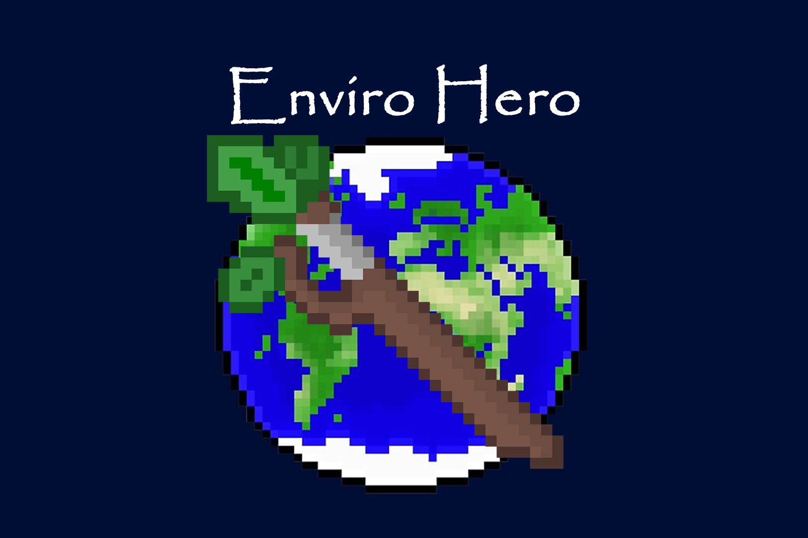

# Enviro Hero

### Getting Started 

1. Install Streamlit: `pip install streamlit`
2. Clone repo: `git clone https://github.com/lumamoto/enviro-hero.git`
3. `cd enviro-hero`
4. Run: `streamlit run main.py`

### Inspiration
To inspire awareness of the imminent threat of global climate change and to communicate a tangible representation to the public of how their actions and positively and negatively impact the environment.

### What it does
This game is a simulator that demonstrates how a user's choices affect the environment. The user can select a multiplier that multiplies their actions across a number of people to see exactly the scale and effect it has. The results of these effects are then displayed visually with geographical and real statically sourced data from [The World Bank Data Catalog](https://datacatalog.worldbank.org/dataset/world-development-indicators).

### How We built it
We used the Streamlit platform for the front end of our web application and Python for the backend and data manipulation with numpy/pandas.

### Challenges We ran into
The biggest challenge of this project was to make it engaging for the user so that they are able to conceptualize the magnitude of the actions they take on a daily basis and how it contributes to C02 and energy production. The biggest difficulty was bridging the gap between how minuscule people believe their actions are on a larger scale. This is why we added a person multiplier so that users could see how their actions, when multiplied by a factor, contribute to these environmental issues.

### Accomplishments that We're proud of
In a short amount of time, the team was able to learn the new Streamlit platform and effectively produce a web application that will help to spread awareness of how we as humans are leaving our footprint on the planet.

### What We learned
The team learned a great deal about data visualization as well as working with front-end tools such as Streamlit.

### What's next for Enviro Hero
The great thing about this web application is that it is easily scalable in that it can represent new data and has the potential to expand into other areas of the environment such as Ocean Acidification and Deforestation.
